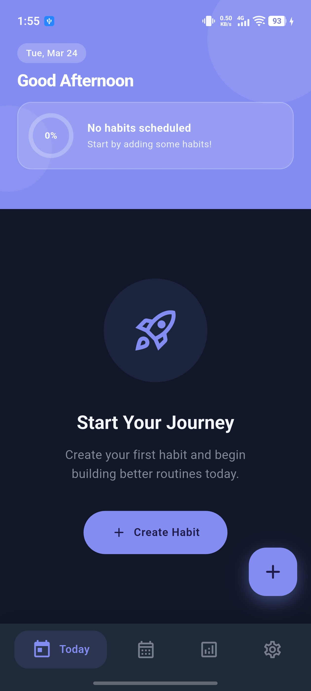
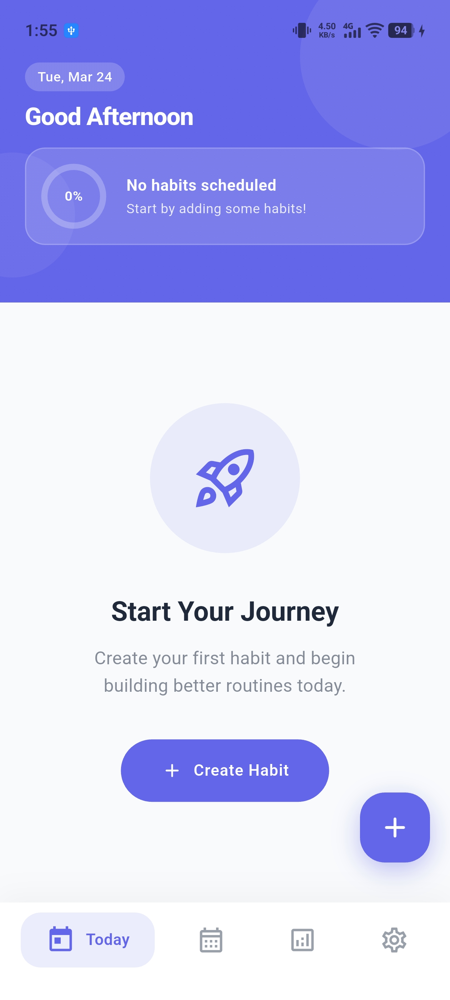
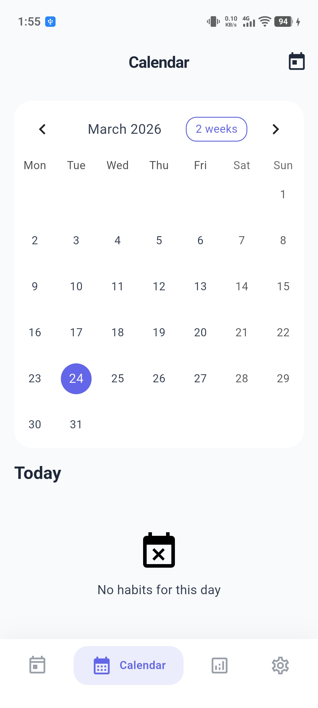
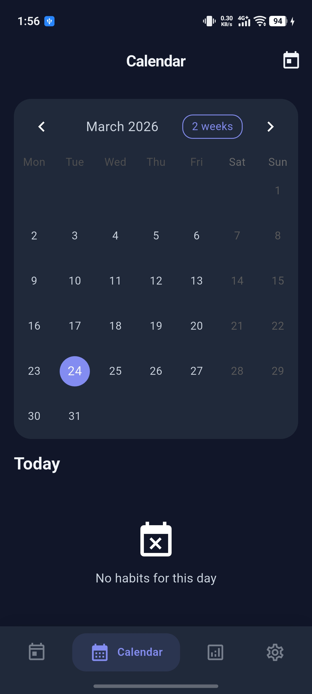
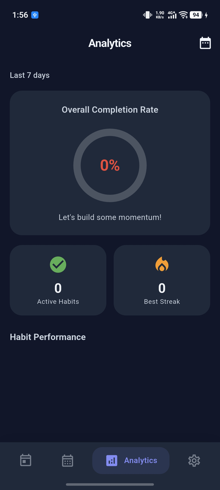
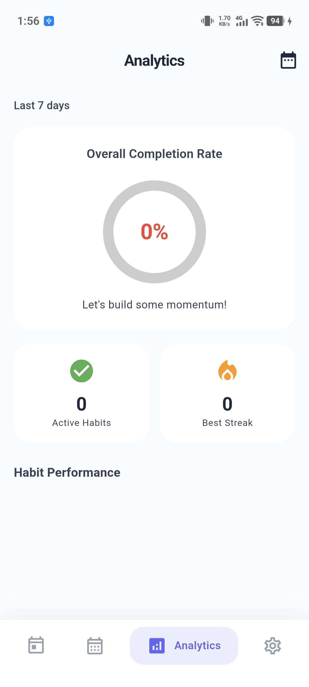
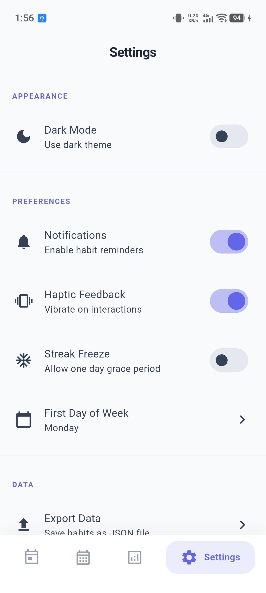
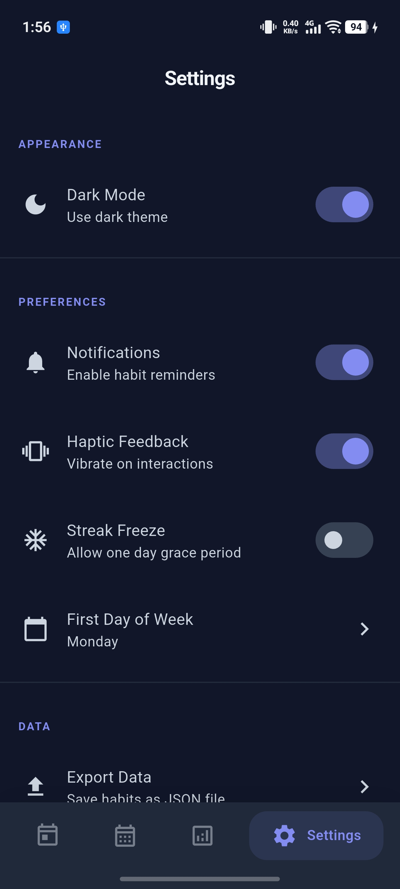

<h1 align="center">Habit Tracker</h1>

<p align="center">
  <strong>A privacy-focused, fully offline habit tracking app built with Flutter</strong>
</p>

<p align="center">
  Build and maintain positive habits with a clean, fast, and minimal user experience
</p>

<p align="center">
  
  
  
  
</p>

<p align="center">
  
  
  
</p>

---

## 📱 Screenshots

<p align="center">
  
  
  
  
</p>

<p align="center">
  
  
  
  
</p>

---

## 📋 Table of Contents

- [Features](#-features)
- [Tech Stack](#-tech-stack)
- [Getting Started](#-getting-started)
- [Project Structure](#-project-structure)
- [Database Schema](#-database-schema)
- [Configuration](#-configuration)
- [Contributing](#-contributing)
- [License](#-license)

---

## ✨ Features

### 🎯 Core Features

| Feature                  | Description                                                    |
| ------------------------ | -------------------------------------------------------------- |
| **Daily Habit Tracking** | Mark habits as complete/incomplete with quick tap interactions |
| **Streak System**        | Track consecutive days with current and longest streak records |
| **Calendar View**        | Weekly and monthly views with visual progress indicators       |
| **Analytics & Reports**  | Completion rate statistics and beautiful progress charts       |
| **Local Notifications**  | Custom reminder times per habit to keep you on track           |

### 📝 Habit Management

- ✅ Create, edit, and delete habits effortlessly
- 📅 Set frequency (daily, weekly, or custom days)
- 🏷️ Organize with categories (Health, Fitness, Learning, Work, etc.)
- 🎨 Custom icons and colors for each habit
- 📦 Archive/unarchive habits to keep your list clean

### 🔒 Privacy-Focused

<table>
  <tr>
    <td align="center">🌐<br/><b>100% Offline</b><br/>No internet required</td>
    <td align="center">💾<br/><b>Local Storage</b><br/>All data in SQLite</td>
    <td align="center">📤<br/><b>Export/Import</b><br/>Backup as JSON</td>
    <td align="center">🚫<br/><b>No Account</b><br/>No sign-up needed</td>
  </tr>
</table>

### 🎨 Beautiful UI/UX

- 🌙 Dark and Light mode support
- ✨ Smooth animations and transitions
- 📱 Material 3 design language
- 🎭 Haptic feedback for interactions

---

## 🛠️ Tech Stack

<table>
  <tr>
    <td><b>Framework</b></td>
    <td>Flutter 3.6+</td>
  </tr>
  <tr>
    <td><b>Language</b></td>
    <td>Dart</td>
  </tr>
  <tr>
    <td><b>State Management</b></td>
    <td>Provider</td>
  </tr>
  <tr>
    <td><b>Database</b></td>
    <td>SQLite (sqflite)</td>
  </tr>
  <tr>
    <td><b>Local Notifications</b></td>
    <td>flutter_local_notifications</td>
  </tr>
  <tr>
    <td><b>Charts</b></td>
    <td>fl_chart</td>
  </tr>
  <tr>
    <td><b>Calendar</b></td>
    <td>table_calendar</td>
  </tr>
</table>

---

## 🚀 Getting Started

### Prerequisites

Before you begin, ensure you have the following installed:

- ✅ Flutter SDK (3.6.0 or later)
- ✅ Dart SDK
- ✅ Android Studio / VS Code
- ✅ Android SDK / Xcode (for iOS)

### Installation

1️⃣ **Clone the repository**

```bash
git clone https://github.com/yourusername/habit-tracker.git
cd habit_tracker
```

2️⃣ **Install dependencies**

```bash
flutter pub get
```

3️⃣ **Run the app**

```bash
flutter run
```

### 📦 Build for Release

<details>
<summary><b>Android</b></summary>

```bash
# APK
flutter build apk --release

# App Bundle (recommended for Play Store)
flutter build appbundle --release
```

</details>

<details>
<summary><b>iOS</b></summary>

```bash
flutter build ios --release
```

</details>

---

## 📁 Project Structure

```
lib/
├── 📄 main.dart                 # App entry point
├── 📄 app.dart                  # Main app widget with navigation
│
├── 📂 core/
│   ├── 📂 constants/            # App-wide constants
│   ├── 📂 themes/               # Light & dark themes
│   └── 📂 utils/                # Utility classes (date, icon, haptic)
│
├── 📂 data/
│   ├── 📂 database/             # SQLite database helper
│   ├── 📂 models/               # Data models (Habit, Category, etc.)
│   └── 📂 repositories/         # Data access layer
│
├── 📂 features/
│   ├── 📂 habits/               # Habit & category providers
│   ├── 📂 tracking/             # Today screen, add/edit habit
│   ├── 📂 calendar/             # Calendar view
│   ├── 📂 analytics/            # Analytics screen
│   └── 📂 settings/             # Settings screen & provider
│
├── 📂 services/
│   ├── 📄 database_service.dart # SQLite initialization
│   └── 📄 notification_service.dart # Local notifications
│
└── 📂 widgets/                  # Reusable UI components
```

---

## 🗄️ Database Schema

<details>
<summary><b>Click to expand database schema</b></summary>

```sql
-- Categories
CREATE TABLE categories (
  id TEXT PRIMARY KEY,
  name TEXT NOT NULL,
  color INTEGER NOT NULL,
  icon TEXT NOT NULL
);

-- Habits
CREATE TABLE habits (
  id TEXT PRIMARY KEY,
  name TEXT NOT NULL,
  description TEXT,
  icon TEXT NOT NULL,
  color INTEGER NOT NULL,
  category_id TEXT,
  frequency TEXT NOT NULL DEFAULT 'daily',
  custom_days TEXT,
  reminder_time TEXT,
  created_at TEXT NOT NULL,
  archived INTEGER NOT NULL DEFAULT 0,
  sort_order INTEGER NOT NULL DEFAULT 0
);

-- Habit Logs
CREATE TABLE habit_logs (
  id TEXT PRIMARY KEY,
  habit_id TEXT NOT NULL,
  date TEXT NOT NULL,
  completed INTEGER NOT NULL DEFAULT 0,
  completed_at TEXT,
  notes TEXT
);

-- Streaks
CREATE TABLE streaks (
  id TEXT PRIMARY KEY,
  habit_id TEXT NOT NULL UNIQUE,
  current_streak INTEGER NOT NULL DEFAULT 0,
  longest_streak INTEGER NOT NULL DEFAULT 0,
  last_completed_date TEXT,
  freeze_used INTEGER NOT NULL DEFAULT 0
);

-- Settings
CREATE TABLE settings (
  key TEXT PRIMARY KEY,
  value TEXT NOT NULL
);
```

</details>

---

## ⚙️ Configuration

### Android Notifications

Notifications are pre-configured. The app requests notification permissions at runtime on Android 13+.

### iOS Notifications

Add the following to your `ios/Runner/Info.plist`:

```xml
<key>UIBackgroundModes</key>
<array>
    <string>fetch</string>
    <string>remote-notification</string>
</array>
```

---

## 🖥️ App Screens

| Screen        | Description                                                |
| ------------- | ---------------------------------------------------------- |
| **Today**     | View today's habits and track completion with a single tap |
| **Calendar**  | View habits by date with visual heatmap indicators         |
| **Analytics** | View statistics, completion rates, and progress charts     |
| **Settings**  | Configure preferences, theme, export/import data           |

---

## 🤝 Contributing

Contributions are what make the open source community amazing! Any contributions you make are **greatly appreciated**.

1. Fork the Project
2. Create your Feature Branch (`git checkout -b feature/AmazingFeature`)
3. Commit your Changes (`git commit -m 'Add some AmazingFeature'`)
4. Push to the Branch (`git push origin feature/AmazingFeature`)
5. Open a Pull Request

---

## 📄 License

This project is licensed under the **MIT License** - see the [LICENSE](LICENSE) file for details.

---

## 💖 Support

If you found this project helpful, please consider giving it a ⭐ on GitHub!

<p align="center">
  <a href="https://github.com/yourusername/habit-tracker">
    
  </a>
</p>

---

<p align="center">
  Made with ❤️ and Flutter
</p>

## Acknowledgments

- Icons from Material Design
- Charts powered by fl_chart
- Calendar powered by table_calendar
